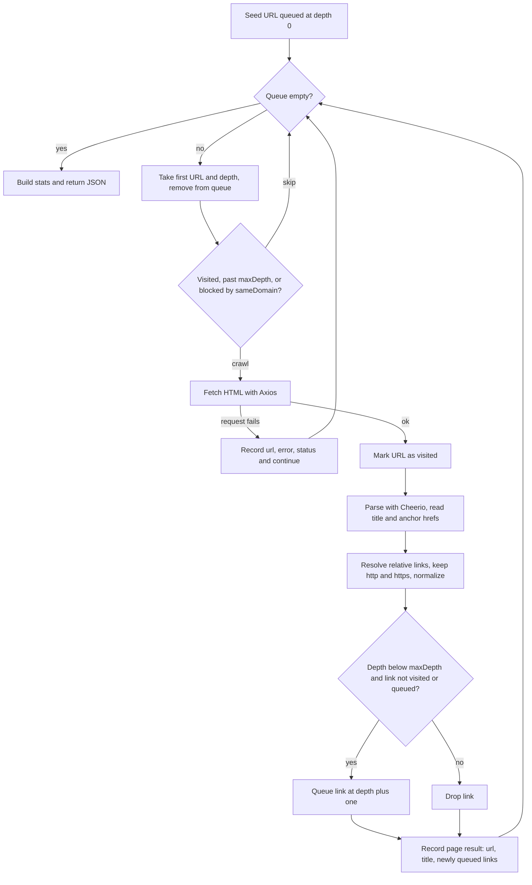
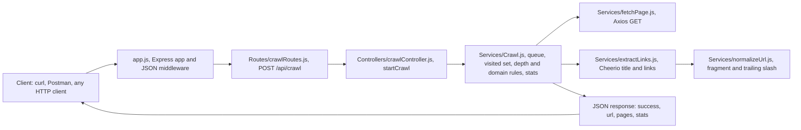

<div align="center">

# 🕷️ CrawlX

### A breadth-first web crawler API built with Node.js and Express

Point it at a seed URL, give it a depth, and it walks the site's link graph and hands you back every page it visited as JSON.

<br>

[](https://github.com/VAMSHIYADAV46/CrawlX)
[](https://github.com/VAMSHIYADAV46/CrawlX/commits)
[](https://github.com/VAMSHIYADAV46/CrawlX/issues)
[](https://github.com/VAMSHIYADAV46/CrawlX/stargazers)

[](https://nodejs.org/)
[](https://expressjs.com/)
[](https://axios-http.com/)
[](https://cheerio.js.org/)

</div>

<br>

---

## Contents

<table>
<tr>
<td valign="top" width="33%">

**Getting oriented**

- [Overview](#overview)
- [Features](#features)
- [How It Works](#how-it-works)
- [Architecture](#architecture)

</td>
<td valign="top" width="33%">

**Running it**

- [Project Structure](#project-structure)
- [Tech Stack](#tech-stack)
- [Installation](#installation)
- [Configuration](#configuration)

</td>
<td valign="top" width="33%">

**Reference**

- [Usage](#usage)
- [API Reference](#api-reference)
- [Key Engineering Decisions](#key-engineering-decisions)
- [Current Limitations](#current-limitations)
- [Roadmap](#roadmap)

</td>
</tr>
</table>

---

## Overview

CrawlX is a backend service focused on the crawling algorithm itself: queue management, depth control, domain filtering, URL normalization, duplicate prevention, per-URL error isolation, and crawl statistics.

<table>
<tr>
<td valign="top" width="50%">

**What exists today**

- One HTTP endpoint, `POST /api/crawl`
- An in-memory breadth-first crawler in the service layer
- MVC plus service-layer file structure
- Per-URL error isolation and crawl statistics

</td>
<td valign="top" width="50%">

**What does not exist yet**

- No frontend or dashboard
- No database, results are returned once then discarded
- No authentication, rate limiting, or concurrency
- No JavaScript rendering or browser automation

</td>
</tr>
</table>

> [!NOTE]
> Everything in this README reflects the code currently in the repository. Planned work is listed separately under [Roadmap](#roadmap).

---

## Features

| Capability                    | How it works                                                           |
| :---------------------------- | :--------------------------------------------------------------------- |
| **Seed-based crawling**       | The crawl starts from a single URL supplied in the request body        |
| **Breadth-first queue**       | A `Map` of URL to crawl depth, processed in insertion order            |
| **Crawl depth control**       | The `maxDepth` parameter caps how many link levels are followed        |
| **Same-domain restriction**   | The optional `sameDomain` flag keeps the crawl on the seed's hostname  |
| **Visited-URL tracking**      | A `Set` guarantees no page is fetched twice within one crawl           |
| **Duplicate prevention**      | A link is queued only when it is neither visited nor already waiting   |
| **URL normalization**         | Fragments removed, trailing slashes stripped, before any comparison    |
| **Protocol filtering**        | Only `http:` and `https:` survive, so `mailto:` and `tel:` are dropped |
| **Relative URL resolution**   | Every `href` is resolved against the page currently being crawled      |
| **Title and link extraction** | Cheerio reads the `<title>` tag and every anchor `href`                |
| **Per-URL error isolation**   | A failed fetch is recorded as a result and the crawl continues         |
| **HTTP status capture**       | The status code is kept when the remote server actually responded      |
| **Crawl statistics**          | Pages processed, successes, failures, unique URLs found, elapsed time  |
| **Custom User-Agent**         | Outgoing requests carry a browser User-Agent header                    |

---

## How It Works

The crawler lives in `Server/Services/Crawl.js` and runs entirely in memory for the lifetime of one request.



### The queue

The queue is a `Map` where each key is a URL and each value is the depth at which that URL was discovered. Storing both together means a URL never travels without its depth. Each iteration takes the first entry, which is the oldest inserted one, so processing is first-in-first-out and the crawl expands breadth-first, one depth level at a time.

### Visited URLs

Every URL that is successfully fetched is added to a `Set` of visited URLs. That Set is checked before a page is crawled, and again before a discovered link is queued. This is what stops the crawler from looping forever between pages that link back to each other.

### Crawl depth

```text
maxDepth = 0   →   only the seed URL is crawled, no links are followed
maxDepth = 1   →   the seed URL, plus every page linked from it
maxDepth = 2   →   the seed URL, its links, and the links found on those pages
```

Two separate checks produce this behavior. A dequeued URL is crawled only when its depth is **less than or equal to** `maxDepth`, and links found on a page are queued only when the current depth is **strictly less than** `maxDepth`. The second check is what stops the queue from growing one level beyond the limit.

> [!IMPORTANT]
> `maxDepth` is required in practice. If it is omitted, the depth comparison fails on the seed itself and the crawl returns an empty `pages` array.

### Same-domain crawling

When `sameDomain` is `true`, a dequeued URL is crawled only if its hostname exactly matches the hostname of the seed URL. Two details are worth knowing:

- The filter is applied when a URL is **dequeued**, not when it is discovered. Off-domain links are still queued and still counted in `discoveredUrlsCount`, they are simply skipped when their turn comes and never appear in `pages`.
- The match is an exact hostname comparison, so `example.com` and `www.example.com` are treated as different domains.

When `sameDomain` is `false` or omitted, any discovered domain is crawled.

### URL normalization

Every extracted link passes through `Server/Services/normalizeUrl.js` before it is compared or queued.

| Input         | Normalized    | Rule                    |
| :------------ | :------------ | :---------------------- |
| `/about#team` | `/about`      | Fragment removed        |
| `/about/`     | `/about`      | Trailing slash stripped |
| `/`           | `/`           | Root path left alone    |
| `/search?q=x` | `/search?q=x` | Query strings preserved |

Normalization happens before the duplicate check, which is what makes deduplication actually prevent repeat fetches instead of just looking like it does.

### Error handling

Each loop iteration is wrapped in its own `try/catch`, so one bad URL never ends the crawl. When a fetch fails, the crawler records an entry containing the URL, the error message, and the HTTP status when the remote server actually responded. Failures covered by this include HTTP errors such as 404 and 403, DNS failures, refused connections, and malformed URLs discovered mid-crawl.

There is no retry logic, no proxy rotation, and no anti-bot handling.

---

## Architecture

MVC plus a service layer. The request path below is the **current** architecture, not a future design.



| Layer           | Responsibility                                                                                                                          |
| :-------------- | :-------------------------------------------------------------------------------------------------------------------------------------- |
| **Routes**      | Declares the endpoint and maps it to a controller function. No logic.                                                                   |
| **Controllers** | Reads `url`, `maxDepth`, and `sameDomain` off the request body, calls the crawl service, sends the JSON response. No crawling logic.    |
| **Services**    | All crawling logic. `Crawl.js` orchestrates the queue and rules, and delegates fetching, parsing, and normalization to focused modules. |
| **app.js**      | Express application setup, JSON and urlencoded middleware, route mounting.                                                              |
| **Server.js**   | Loads environment variables and starts the HTTP listener.                                                                               |

---

## Project Structure

```text
CrawlX/
├── Server/
│   ├── Controllers/
│   │   └── crawlController.js     Reads request body, calls Crawl, returns JSON
│   ├── Routes/
│   │   └── crawlRoutes.js         Declares POST /api/crawl
│   ├── Services/
│   │   ├── Crawl.js               Queue, visited set, depth and domain rules, stats
│   │   ├── fetchPage.js           Axios GET with a custom User-Agent, returns HTML
│   │   ├── extractLinks.js        Cheerio parsing, title plus filtered links
│   │   └── normalizeUrl.js        Strips fragment and trailing slash
│   ├── utilities.js               popFirstFromSet helper, not currently imported
│   ├── app.js                     Express app configuration
│   └── Server.js                  Entry point, reads PORT and starts the server
├── .gitignore
├── package.json
└── package-lock.json
```

---

## Tech Stack

| Technology  |  Version   | Used for                             |
| :---------- | :--------: | :----------------------------------- |
| **Node.js** | `20.18.1+` | Runtime, the project uses ES modules |
| **Express** |  `5.2.1`   | HTTP server and routing              |
| **Axios**   |  `1.20.0`  | Fetching page HTML                   |
| **Cheerio** |  `1.2.0`   | Server-side HTML parsing             |
| **dotenv**  |  `17.4.2`  | Loading `PORT` from a `.env` file    |
| **npm**     |  bundled   | Dependency management                |

No database, frontend framework, CSS framework, browser automation tool, or container runtime is used in this repository.

> [!TIP]
> Node 20.18.1 is the real floor because Cheerio 1.2.0 requires it, even though Express itself accepts Node 18.

---

## Installation

**1. Clone and install**

```bash
git clone https://github.com/VAMSHIYADAV46/CrawlX.git
cd CrawlX
npm install
```

**2. Start the server**

```bash
node Server/Server.js
```

`package.json` does not define a `start` or `dev` script yet, so the server is started by pointing Node at the entry file directly.

**3. Confirm it is running**

```text
Server is running on port : 8080
```

| Route        | Method | Purpose                                          |
| :----------- | :----: | :----------------------------------------------- |
| `/`          | `GET`  | Plain health check, returns a short HTML message |
| `/api/crawl` | `POST` | Runs a crawl                                     |

---

## Configuration

Only one environment variable is read anywhere in the codebase.

| Variable | Required | Default | Read in            |
| :------- | :------: | :-----: | :----------------- |
| `PORT`   |    No    | `8080`  | `Server/Server.js` |

`dotenv/config` is imported in `Server.js`, so an optional `.env` file in the project root is picked up automatically. `.env` is gitignored and there is no `.env.example` committed. The project runs with no `.env` file at all.

```env
PORT=8080
```

---

## Usage

Send a POST request with a JSON body. `Content-Type: application/json` is required, since the app parses JSON bodies with `express.json()`.

| Field        |   Type    | Required | Description                                                                                             |
| :----------- | :-------: | :------: | :------------------------------------------------------------------------------------------------------ |
| `url`        | `string`  |   Yes    | Seed URL to start from. Must be an absolute, parseable URL.                                             |
| `maxDepth`   | `number`  |   Yes    | How many link levels to follow. `0` crawls only the seed. Omitting it returns an empty `pages` array.   |
| `sameDomain` | `boolean` |    No    | When `true`, only URLs on the seed's exact hostname are crawled. Defaults to falsy, meaning any domain. |

---

## API Reference

### `POST /api/crawl`

Runs a full crawl synchronously and returns the complete result. The HTTP connection stays open for the entire crawl, so a large `maxDepth` on a big site can take a long time to respond.

**Request**

```bash
curl -X POST http://localhost:8080/api/crawl \
  -H "Content-Type: application/json" \
  -d '{
    "url": "https://example.com",
    "maxDepth": 1,
    "sameDomain": true
  }'
```

**Response**

```json
{
  "success": true,
  "url": "https://example.com",
  "pages": [
    {
      "url": "https://example.com",
      "title": "Example Domain",
      "urls": [
        "https://example.com/about",
        "https://example.com/contact"
      ]
    },
    {
      "url": "https://example.com/about",
      "title": "About",
      "urls": []
    },
    {
      "url": "https://example.com/missing",
      "error": "Request failed with status code 404",
      "status": 404
    }
  ],
  "stats": {
    "pagesProcessed": 3,
    "successfulPages": 2,
    "failedPages": 1,
    "discoveredUrlsCount": 4,
    "timeDuration": "Time took: 0m 2s"
  }
}
```

#### Top-level fields

| Field     |   Type    | Description                                                                                                                 |
| :-------- | :-------: | :-------------------------------------------------------------------------------------------------------------------------- |
| `success` | `boolean` | Always `true` when the crawl runs to completion. It does not mean every page succeeded, check `stats.failedPages` for that. |
| `url`     | `string`  | The seed URL exactly as it was sent in the request.                                                                         |
| `pages`   |  `array`  | One entry per URL actually fetched or attempted. URLs skipped by the depth or domain rules do not appear here.              |
| `stats`   | `object`  | Summary counters for the crawl.                                                                                             |

#### Page entry, successful

| Field   |   Type   | Description                                                                                                                                                                                                |
| :------ | :------: | :--------------------------------------------------------------------------------------------------------------------------------------------------------------------------------------------------------- |
| `url`   | `string` | The crawled URL.                                                                                                                                                                                           |
| `title` | `string` | Trimmed text of the page's `<title>` tag, an empty string when there is none.                                                                                                                              |
| `urls`  | `array`  | Links on this page that were **newly added to the queue**. Links already visited or already queued are excluded, and at `maxDepth` this array is always empty. It is not a list of every link on the page. |

#### Page entry, failed

| Field    |        Type        | Description                                                                                                                |
| :------- | :----------------: | :------------------------------------------------------------------------------------------------------------------------- |
| `url`    |      `string`      | The URL that failed.                                                                                                       |
| `error`  |      `string`      | The error message, for example `Request failed with status code 404`.                                                      |
| `status` | `number` \| `null` | HTTP status when the server responded, otherwise `null` for DNS failures, refused connections, and similar network errors. |

#### Statistics

| Field                 |   Type   | Description                                                                                                                                             |
| :-------------------- | :------: | :------------------------------------------------------------------------------------------------------------------------------------------------------ |
| `pagesProcessed`      | `number` | Total entries in `pages`, successes plus failures.                                                                                                      |
| `successfulPages`     | `number` | Entries with no `error` field.                                                                                                                          |
| `failedPages`         | `number` | Entries with an `error` field.                                                                                                                          |
| `discoveredUrlsCount` | `number` | Unique URLs ever added to the queue, including the seed and including URLs later skipped by the same-domain rule. Usually higher than `pagesProcessed`. |
| `timeDuration`        | `string` | Wall-clock crawl time as a preformatted string, whole seconds only.                                                                                     |

#### Error responses

> [!WARNING]
> There is no request validation yet. A missing or unparseable `url` throws inside the service, which Express 5 turns into a `500` response carrying a stack trace. Returning a proper `400` is on the roadmap.

---

## Key Engineering Decisions

<details>
<summary><b>A <code>Map</code> for the queue</b></summary>

<br>

A queue entry needs two things, the URL and the depth it was found at. A `Map` keeps them together in one structure, gives `O(1)` lookups through `queue.has(link)` so the same URL is never queued twice, and preserves insertion order, which is what makes the traversal breadth-first without a separate ordering mechanism.

</details>

<details>
<summary><b>A <code>Set</code> for visited URLs</b></summary>

<br>

Membership testing is the only operation ever performed on visited URLs, and it happens on every dequeue and on every discovered link. A `Set` gives that in `O(1)` instead of the `O(n)` scan an array would cost, which matters because the check runs once per link, not once per page.

</details>

<details>
<summary><b>A separate <code>Set</code> for discovered URLs</b></summary>

<br>

`discoveredUrls` exists purely for statistics. Tracking every unique URL the crawl ever encountered, including ones skipped by the domain rule, gives a picture of the crawl's reach that `pages.length` cannot, since `pages` only holds URLs that were actually attempted.

</details>

<details>
<summary><b>Normalize before deduplicating</b></summary>

<br>

`/about`, `/about/`, and `/about#team` are one page. Normalizing first means the visited and queue checks compare canonical URLs, so deduplication actually prevents repeat fetches instead of just looking like it does.

</details>

<details>
<summary><b>Splitting the services</b></summary>

<br>

`Crawl.js` owns the algorithm, the queue, the rules, and the statistics. Fetching, parsing, and normalization live in `fetchPage.js`, `extractLinks.js`, and `normalizeUrl.js`. Each has a single responsibility and can be changed or tested without touching the crawl loop. Swapping Axios for another HTTP client, for example, touches one file.

</details>

<details>
<summary><b>Error isolation inside the loop</b></summary>

<br>

The `try/catch` sits inside the `while` loop rather than around it. A broken link, a dead host, or a 403 costs one result entry, not the whole crawl.

</details>

---

## Current Limitations

These are honest constraints of the code as it exists today.

| Limitation                             | Detail                                                                                                                           |
| :------------------------------------- | :------------------------------------------------------------------------------------------------------------------------------- |
| **Static HTML only**                   | Pages that build their content with JavaScript are not rendered. Browser automation is intentionally out of scope.               |
| **No persistence**                     | Results exist only in memory for the duration of the request. No crawl history, no way to retrieve a past crawl.                 |
| **Sequential crawling**                | URLs are fetched one at a time with no concurrency, so crawl time grows linearly with page count.                                |
| **No politeness controls**             | No `robots.txt` handling, rate limiting, or per-domain delay. Be careful which sites you point this at.                          |
| **No request validation**              | A missing or invalid `url` produces a 500 with a stack trace rather than a 400. Omitting `maxDepth` silently returns zero pages. |
| **`success` is always `true`**         | It reflects crawl completion, not per-page outcomes.                                                                             |
| **Exact hostname matching**            | With `sameDomain: true`, `www.example.com` and `blog.example.com` count as different domains from `example.com`.                 |
| **Failed URLs are not marked visited** | A URL whose fetch fails can be queued and retried if another page links to it later in the same crawl.                           |
| **Blocking request cycle**             | The whole crawl runs before the response is sent, with no timeout, cancellation, or progress reporting.                          |
| **No authentication**                  | The API is open.                                                                                                                 |
| **No automated tests**                 | `npm test` is still the default placeholder script.                                                                              |
| **Unused helper**                      | `Server/utilities.js` contains a `popFirstFromSet` function that nothing currently imports.                                      |

---

## Roadmap

<table>
<tr>
<td valign="top" width="50%">

### Completed

- [x] Express server, MVC and service layers
- [x] `POST /api/crawl` endpoint
- [x] Breadth-first queue holding URL and depth
- [x] Visited tracking and duplicate prevention
- [x] Configurable crawl depth
- [x] Optional same-domain restriction
- [x] URL normalization and protocol filtering
- [x] Relative URL resolution
- [x] Title and link extraction with Cheerio
- [x] Per-URL error isolation with status capture
- [x] Crawl statistics and duration measurement

</td>
<td valign="top" width="50%">

### Planned

- [ ] Request validation with proper `400` responses
- [ ] `start` and `dev` scripts in `package.json`
- [ ] Concurrency with a worker limit
- [ ] Rate limiting and per-domain politeness delay
- [ ] `robots.txt` compliance
- [ ] Custom CSS selector extraction rules
- [ ] Automated tests
- [ ] Persistence layer for stored crawls
- [ ] Async crawl jobs with a status endpoint
- [ ] Frontend dashboard
- [ ] Deployment configuration

</td>
</tr>
</table>

---

## Contributing

1. Fork the repository and clone your fork
2. Create a branch, `git checkout -b feature/your-feature`
3. Make your changes, matching the existing structure. Crawling logic belongs in `Server/Services/`
4. Commit, `git commit -m "Add your feature"`
5. Push and open a pull request describing what changed and why

Issues and suggestions are welcome through the [issue tracker](https://github.com/VAMSHIYADAV46/CrawlX/issues).

---

## License

No `LICENSE` file is committed to this repository yet. `package.json` currently declares `ISC`. Add a license file to make the terms explicit.

---

<div align="center">

### Mekala Vamshi Yadav

[](https://github.com/VAMSHIYADAV46)
[](https://linkedin.com/in/mekalavamshiyadav)
[](https://vamshis-portfolio.onrender.com/)

<br>

If CrawlX is useful to you, a star is appreciated.

</div>
