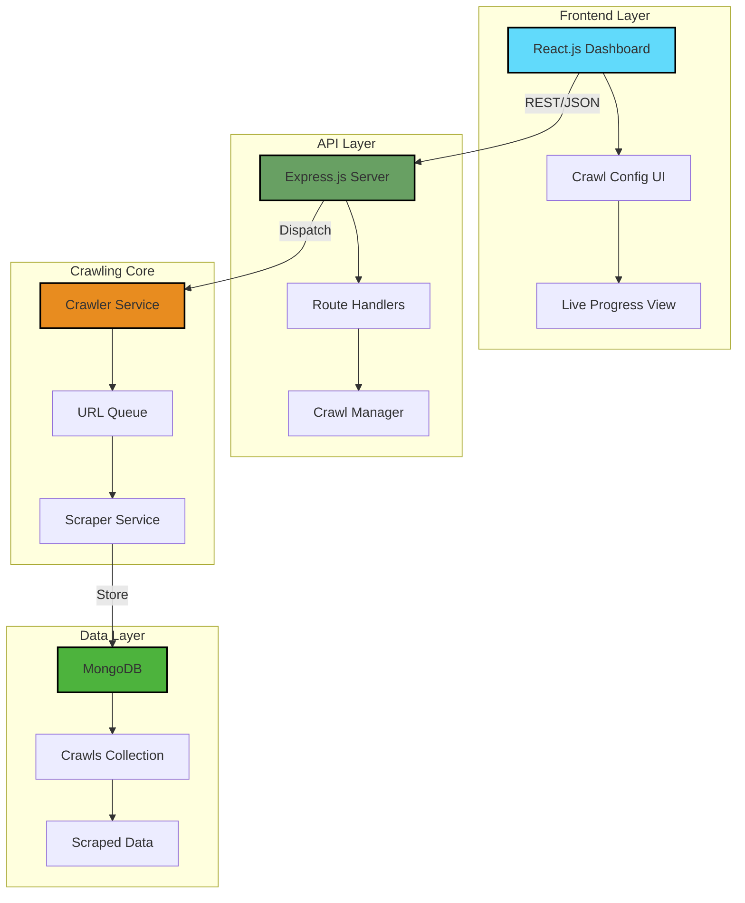

<div align="center">

# 🕷️ **CrawlX**

### *Full-Stack Web Crawling & Scraping Platform*

[](https://github.com/VAMSHIYADAV46/CrawlX)
[](https://github.com/VAMSHIYADAV46/CrawlX/stargazers)
[](https://github.com/VAMSHIYADAV46/CrawlX/commits)
[](https://github.com/VAMSHIYADAV46/CrawlX/issues)
[](LICENSE)

[](https://reactjs.org/)
[](https://nodejs.org/)
[](https://expressjs.com/)
[](https://www.mongodb.com/)
[](https://cheerio.js.org/)
[](https://tailwindcss.com/)

[**Live Demo**](https://crawlx.onrender.com) • [**Documentation**](https://github.com/VAMSHIYADAV46/CrawlX/wiki) • [**Report Bug**](https://github.com/VAMSHIYADAV46/CrawlX/issues) • [**Request Feature**](https://github.com/VAMSHIYADAV46/CrawlX/issues)

</div>

---

## 🚀 **Introduction**

**CrawlX** is a full-stack platform for discovering, crawling, and extracting structured data from websites, without writing a one-off scraping script for every target site. Point it at a seed URL, set a depth and a domain boundary, and watch it work through the site in real time.

### 💡 **The Problem**
Pulling structured data from a website usually means a throwaway script: no queueing, no duplicate protection, no visibility into what happened during the run, and nothing reusable for the next site.

### ✨ **Our Solution**
CrawlX turns that into a repeatable system. A queue-driven crawler discovers and visits pages within a configurable depth and domain boundary, a Cheerio-powered scraper extracts structured content from each page, and a processing layer cleans and deduplicates the results before they land in MongoDB, all visible from a live dashboard.

### 🎯 **What Makes CrawlX Unique**
- **Queue-Driven Crawling**: BFS-style URL queue with depth control and domain restriction
- **Duplicate-Safe by Design**: a visited-URL set prevents repeat requests and infinite loops
- **Structured Extraction**: Cheerio-based parsing pulls titles, headings, links, images, and meta info into clean records
- **Full Crawl History**: every session (status, pages crawled/failed, depth, timing) stays queryable afterward
- **Live Progress Dashboard**: a React + Tailwind UI that shows exactly what the crawler is doing, as it happens

---

## ⚡ **Features**

<table>
<tr>
<td width="50%">

### 🕷️ **Crawling Engine**
- 🔗 **URL Queue Management** - seed URL to full crawl, automatically
- 🚫 **Duplicate URL Prevention** - Set-based visited tracking
- 📏 **Configurable Crawl Depth** - depth 0 through N
- 🌐 **Domain Restriction** - stay on the target domain only
- 🧹 **Data Processing Pipeline** - clean, validate, and dedupe before storage

</td>
<td width="50%">

### 🎨 **Dashboard & UX**
- 📊 **Live Crawl Progress** - pages discovered, crawled, failed, queue size
- 📁 **Crawl History** - browse and revisit every past session
- 🔍 **Results Table** - sortable results with a per-page detail view
- 📱 **Responsive Design** - works on desktop and mobile
- ⚙️ **REST API** - every dashboard action is backed by a documented endpoint

</td>
</tr>
</table>

---

## 🏗️ **System Architecture**



---

## 🛠️ **Tech Stack**

| Category | Technology | Description |
|----------|------------|-------------|
| **Frontend** |  | Component-based dashboard UI |
| **Styling** |  | Utility-first CSS framework |
| **Backend** |  | JavaScript runtime |
| **Framework** |  | REST API server |
| **Database** |  | NoSQL storage for crawls and results |
| **Scraping** |  | Server-side HTML parsing |
| **API** | REST APIs | JSON over HTTP between frontend and backend |
| **Data Format** | JSON | Request/response and stored document shape |

---

## 📦 **Installation & Setup**

### **Prerequisites**
- Node.js 18.x or higher
- MongoDB 6.0 or higher
- npm or yarn package manager

### **1️⃣ Clone the Repository**

```bash
git clone https://github.com/VAMSHIYADAV46/CrawlX.git
cd CrawlX
```

### **2️⃣ Backend Setup**

```bash
# Navigate to backend directory
cd backend

# Install dependencies
npm install

# Create environment variables
cp .env.example .env

# Configure your .env file
nano .env
```

**Environment Variables (.env):**
```env
# Server Configuration
PORT=5000
NODE_ENV=development

# Database
MONGODB_URI=mongodb://localhost:27017/crawlx
DB_NAME=crawlx

# CORS
FRONTEND_URL=http://localhost:3000
```

```bash
# Start MongoDB service
sudo systemctl start mongodb

# Run backend server
npm run dev
```

### **3️⃣ Frontend Setup**

```bash
# Open new terminal and navigate to frontend
cd ../frontend

# Install dependencies
npm install

# Create environment variables
cp .env.example .env

# Configure frontend .env
REACT_APP_API_URL=http://localhost:5000/api

# Start development server
npm start
```

### **4️⃣ Access the Application**

Open your browser and navigate to:
- Frontend: `http://localhost:3000`
- Backend API: `http://localhost:5000/api`

---

## 💻 **Usage**

### **Getting Started**

1. **Configure a Crawl**: enter a seed URL, set max depth, and toggle same-domain-only
2. **Start Crawling**: submit the form and get redirected to the live progress view
3. **Review Results**: watch the results table fill in, then open any page for its full extracted record

### **Example Request**

**Request:** `POST /api/crawl`
```json
{
  "startUrl": "https://example.com",
  "maxDepth": 2,
  "sameDomainOnly": true
}
```

**Response:**
```json
{
  "crawlId": "665f1b2e9a3c7d0012ab34cd",
  "status": "queued"
}
```

<!-- ### **Demo Screenshots**

| Crawl Config | Live Progress | Results |
|--------------|----------------|---------|
|  |  |  | -->

---

## 📡 **API Reference**

| Method | Endpoint | Description |
|--------|----------|-------------|
| `POST` | `/api/crawl` | Start a new crawl |
| `GET` | `/api/crawls` | List all crawl sessions |
| `GET` | `/api/crawls/:id` | Get one crawl session's status |
| `GET` | `/api/results?crawlId=` | Get results for a crawl session |
| `GET` | `/api/results/:id` | Get one extracted page's full record |
| `DELETE` | `/api/crawls/:id` | Delete a crawl session |

---

## 🗺️ **Roadmap**

### **Phase 1: Foundation** ✅
- [x] URL queue and crawl loop
- [x] Duplicate URL prevention
- [x] Crawl depth control
- [x] Domain restriction
- [x] Cheerio-based scraping and data processing

### **Phase 2: Enhancement** 🚧
- [ ] Crawl history dashboard
- [ ] Export results (CSV/JSON)
- [ ] Search and filter results
- [ ] Scheduled/recurring crawls

### **Phase 3: Advanced Features** 📋
- [ ] JavaScript-rendered page support (Puppeteer/Playwright)
- [ ] Custom CSS-selector extraction rules per crawl
- [ ] Rate limiting and per-domain politeness delay
- [ ] robots.txt compliance

### **Phase 4: Enterprise** 🎯
- [ ] Multi-user accounts and auth
- [ ] Team workspaces
- [ ] Usage analytics
- [ ] Webhook notifications on crawl completion

### **Phase 5: Deployment** 🚀
- [ ] Docker containerization
- [ ] CI/CD pipeline
- [ ] Frontend on Vercel, backend on Render/Railway
- [ ] Performance monitoring

---

## 🤝 **Contributing**

Contributions are welcome. Here's how to help:

### **Development Workflow**

1. **Fork the Repository**
   ```bash
   git clone https://github.com/YOUR_USERNAME/CrawlX.git
   ```

2. **Create Feature Branch**
   ```bash
   git checkout -b feature/AmazingFeature
   ```

3. **Make Your Changes**
   - Write clean, documented code
   - Follow existing code style
   - Add tests for new features

4. **Commit Changes**
   ```bash
   git add .
   git commit -m "✨ Add AmazingFeature"
   ```

5. **Push to Branch**
   ```bash
   git push origin feature/AmazingFeature
   ```

6. **Open Pull Request**
   - Provide a clear description
   - Reference related issues
   - Include screenshots if applicable

### **Commit Convention**
- ✨ `:sparkles:` New features
- 🐛 `:bug:` Bug fixes
- 📚 `:books:` Documentation
- 🎨 `:art:` Code style
- ⚡ `:zap:` Performance
- 🔧 `:wrench:` Configuration

---

## 📄 **License**

This project is licensed under the MIT License, see the [LICENSE](LICENSE) file for details.

```
MIT License

Copyright (c) 2026 Mekala Vamshi Yadav

Permission is hereby granted, free of charge, to any person obtaining a copy
of this software and associated documentation files (the "Software"), to deal
in the Software without restriction...
```

---

## 🙏 **Acknowledgements**

### **Special Thanks To:**
- ⚛️ [React Team](https://reactjs.org/) - For the amazing framework
- 🟢 [Node.js Community](https://nodejs.org/) - For the runtime
- 🚂 [Express.js](https://expressjs.com/) - For the web framework
- 🍃 [MongoDB Team](https://www.mongodb.com/) - For the database
- 🥄 [Cheerio](https://cheerio.js.org/) - For fast, familiar HTML parsing
- 🎨 [Tailwind CSS](https://tailwindcss.com/) - For styling utilities
- 💎 All contributors and supporters

### **Inspirations:**
- Scrapy - Structured, queue-based crawling
- Apify - Crawl monitoring and dashboards
- Postman - Clean, readable API tooling

---

## 👨‍💻 **Author**

<div align="center">

### **Mekala Vamshi Yadav**

[](https://github.com/VAMSHIYADAV46)
[](https://linkedin.com/in/mekalavamshiyadav)
[](https://vamshis-portfolio.onrender.com/)

</div>

---

## 🔗 **Project Links**

- 🌐 **Repository**: [https://github.com/VAMSHIYADAV46/CrawlX](https://github.com/VAMSHIYADAV46/CrawlX)
- 📖 **Documentation**: [https://github.com/VAMSHIYADAV46/CrawlX/wiki](https://github.com/VAMSHIYADAV46/CrawlX/wiki)
- 🐛 **Issue Tracker**: [https://github.com/VAMSHIYADAV46/CrawlX/issues](https://github.com/VAMSHIYADAV46/CrawlX/issues)
- 💬 **Discussions**: [https://github.com/VAMSHIYADAV46/CrawlX/discussions](https://github.com/VAMSHIYADAV46/CrawlX/discussions)

---

<div align="center">

**⭐ Star this repository if you find it helpful!**

Made with ❤️ by [Mekala Vamshi Yadav](https://github.com/VAMSHIYADAV46)

</div>
